# 🌊 FloodTriage & Flood CAP Alert System

> **An enterprise-grade, physics-informed AI hydroinformatics platform integrated with an off-grid last-mile emergency broadcast mesh (CAP 1.2 • Bluetooth Low Energy • Wi-Fi Trapdoor Captive Portal).**

---

## 📑 Table of Contents

1. [🌊 Part 1: FloodTriage — Hydroinformatics & Early Warning Platform](#-part-1-floodtriage--hydroinformatics--early-warning-platform)
   - [System Architecture](#1-system-architecture)
   - [Mathematical Hydrology Formulations](#2-mathematical-hydrology-formulations)
   - [The 25-Year Asia Flood Telemetry Dataset](#3-the-25-year-asia-flood-telemetry-dataset)
   - [Multi-Source Real-Time API Engine](#4-multi-source-real-time-api-engine)
2. [📡 Part 2: Flood CAP Alert & Off-Grid Mesh System](#-part-2-flood-cap-alert--off-grid-mesh-system)
   - [Last-Mile Problem & Off-Grid Mission](#last-mile-problem--off-grid-mission)
   - [🚨 Trapdoor Mode (Delayed Wi-Fi Hijack)](#-trapdoor-mode-delayed-wi-fi-hijack)
   - [🆘 SOS Dispatch System (FloodTriage Integration)](#-sos-dispatch-system-floodtriage-integration)
   - [Architecture Flow](#architecture-flow)
3. [📂 Unified Project Structure](#-unified-project-structure)
4. [🚀 Quickstart & Installation Guide](#-quickstart--installation-guide)
5. [🧪 Automated Test Verification](#-automated-test-verification)
6. [🗺️ Project Phases](#️-project-phases)
7. [📄 License](#-license)

---

# 🌊 Part 1: FloodTriage — Hydroinformatics & Early Warning Platform

> **An enterprise-grade, physics-informed AI and hydroinformatics platform engineered for transboundary river basins across Asia.** Combining **1D Saint-Venant Dynamic Momentum Conservation**, **Muskingum-Cunge Diffusive Wave Routing**, **Green-Ampt Non-Linear Infiltration Physics**, and **State-Space Extended Kalman Filtering** with real-time multi-source situational web intelligence and an ultra-sleek, zero-jargon glassmorphic command center.

---

### 1. System Architecture

```mermaid
flowchart TD
    subgraph DataIngestion ["1. Real-Time Telemetry & Data Ingestion"]
        A1["25-Year Asia Dataset<br/>456,600 Daily Records<br/>50 Stations • 10 Basins • 7 Nations"]
        A2["Live Weather Telemetry Feed<br/>Dynamic 7-Day Rainfall & Soil Moisture<br/>Zero Hardcoding"]
        A3["Tavily Web Search Pool<br/>14 API Keys • Atomic Round-Robin<br/>Real-Time News & Alerts"]
    end

    subgraph MathematicalHydrology ["2. Physics-Informed Hydrology Core (backend/app/ml)"]
        B1["Saint-Venant 1D PDE<br/>Dynamic Momentum & Friction Slope<br/>Manning-Strickler Channel Hydraulics"]
        B2["Muskingum-Cunge Wave Router<br/>Diffusive Hydrograph Translation<br/>Celerity & Reynolds Diffusion"]
        B3["Green-Ampt Infiltration Solver<br/>Matric Suction & Saturation Defect<br/>Direct Runoff Coupling"]
        B4["Extended Kalman Filter (EKF)<br/>State-Space [h, dh/dt, S]^T<br/>Recursive Bayesian Telemetry Update"]
    end

    subgraph AdvancedEngines ["3. Specialized Hydroinformatics Engines"]
        C1["2D FNO SWE Solver<br/>Fourier Neural Operator (Modes=6)<br/>Continuous Spatial Floodplain Depth"]
        C2["Ensemble Kalman Filter (EnKF)<br/>20 Ensemble Members<br/>SAR Satellite Radar Assimilation"]
        C3["ST-GNN River Router<br/>Diffusion Convolution DAG<br/>Confluence Travel-Time Propagation"]
        C4["MPC Dam Gate Optimizer<br/>24-Hour Receding Horizon<br/>Reservoir Attenuation Control"]
        C5["Wasserstein Metric Evaluator<br/>Optimal Transport Earth Mover's Distance<br/>Phase-Aware Hydrograph Validation"]
    end

    subgraph IntelligenceEngine ["4. Situational AI & Emergency Synthesis"]
        D1["Tavily Multi-Key Round-Robin<br/>Thread-Safe Rotation & HTTP 429 Fallback"]
        D2["Incident Urgency Analyzer<br/>Urgency Score (0-100) & Threat Matrix<br/>Civil Protection Advisories"]
        D3["Emergency Copilot<br/>Automated Briefing Synthesis<br/>Plain-Language Plain English Explanations"]
    end

    subgraph FrontendUI ["5. Glassmorphic Zero-Jargon UI (Next.js + Tailwind)"]
        E1["1. Live Flood Map<br/>Basin Boundaries • Proximity Routing<br/>Interactive OpenStreetMap Search"]
        E2["2. River Stage Prediction<br/>7-Day Real-World Precipitation<br/>Saint-Venant Hydrograph Crest Range"]
        E3["3. Soil Moisture Prediction<br/>Green-Ampt Infiltration Dynamics<br/>Saturation Deficit & Runoff Partition"]
        E4["4. Satellite Assimilation<br/>Sentinel-1 SAR Radar Altimetry<br/>50-Member EnKF Variance Reduction"]
        E5["5. Drainage Simulator<br/>Culvert Blockage & Dam Failure<br/>Affected Population & Scrubber"]
        E6["6. Multi-Model Ensemble<br/>5 Advanced Mathematical Engines<br/>Inverse-Variance Weighted Consensus + AI"]
        E7["7. Live News & Alerts<br/>14-Key Rotating Tavily Stream<br/>Real-Time Urgency & Field Reports"]
    end

    DataIngestion --> MathematicalHydrology
    DataIngestion --> IntelligenceEngine
    MathematicalHydrology --> AdvancedEngines
    MathematicalHydrology --> FrontendUI
    AdvancedEngines --> FrontendUI
    IntelligenceEngine --> FrontendUI
```



---

### 2. Mathematical Hydrology Formulations

The core hydrological simulation in `backend/app/ml/` implements continuum mechanics and recursive Bayesian estimation:

#### 1. 1D Saint-Venant Shallow Water Equations with Dynamic Momentum
[`floodtriage/backend/app/ml/saint_venant_pde.py`](file:///floodtriage/backend/app/ml/saint_venant_pde.py)

$$\frac{\partial A}{\partial t} + \frac{\partial Q}{\partial x} = q_L$$

$$\frac{\partial Q}{\partial t} + \frac{\partial}{\partial x}\left(\frac{\beta Q^2}{A}\right) + g A \frac{\partial h}{\partial x} + g A (S_f - S_0) = 0$$

Where:
- $A(h) = B h + z h^2$: Wetted cross-sectional area for a trapezoidal channel.
- $P(h) = B + 2h\sqrt{1 + z^2}$: Wetted perimeter.
- $R_h(h) = \frac{A(h)}{P(h)}$: Hydraulic radius.
- $S_f$: Manning-Strickler dynamic friction slope:
  $$S_f = \frac{n^2 |Q| Q}{A^2 R_h^{4/3}}$$
- $\beta = 1.05$: Boussinesq velocity distribution momentum coefficient.
- $q_L$: Lateral precipitation inflow rate per unit river length ($m^2/s$).

#### 2. Variable-Parameter Muskingum-Cunge Wave Routing
[`floodtriage/backend/app/ml/muskingum_cunge.py`](file:///floodtriage/backend/app/ml/muskingum_cunge.py)

$$Q_{j+1}^{n+1} = C_1 Q_j^{n+1} + C_2 Q_j^n + C_3 Q_{j+1}^n$$

The physical routing coefficients satisfy $C_1 + C_2 + C_3 = 1.0$:

$$C_1 = \frac{\Delta t - 2 K X}{2 K (1 - X) + \Delta t}, \quad C_2 = \frac{\Delta t + 2 K X}{2 K (1 - X) + \Delta t}, \quad C_3 = \frac{2 K (1 - X) - \Delta t}{2 K (1 - X) + \Delta t}$$

Hydraulic parameterization based on wave celerity $c_k = \frac{5}{3} v_0$:
- Travel time interval: $K = \frac{\Delta x}{c_k}$
- Reynolds diffusion attenuation factor: $X = \frac{1}{2}\left(1 - \frac{Q_0}{B S_0 c_k \Delta x}\right)$, bounded within $[0.05, 0.48]$.

#### 3. Green-Ampt Non-Linear Infiltration Physics
[`floodtriage/backend/app/ml/green_ampt.py`](file:///floodtriage/backend/app/ml/green_ampt.py)

Infiltration capacity rate $f(t)$ under ponding conditions:

$$f(t) = K_s \left(1 + \frac{\psi_f \Delta \theta}{F(t)}\right)$$

- $K_s = 6.5\text{ mm/hr}$: Saturated hydraulic conductivity.
- $\psi_f = 110\text{ mm}$: Wetting front soil matric suction head.
- $\Delta \theta = \theta_s - \theta_i$: Antecedent soil moisture saturation deficit.
- Dynamic cumulative infiltration capacity over $24\text{h}$:
  $$F_{\text{potential}} = 24 K_s + \psi_f \Delta \theta \ln\left(1 + \frac{24 K_s}{\psi_f \Delta \theta}\right)$$
Direct surface runoff excess is computed dynamically from cumulative storm rainfall without hardcoded static tables.

#### 4. State-Space Extended Kalman Filtering (EKF)
[`floodtriage/backend/app/ml/extended_kalman_filter.py`](file:///floodtriage/backend/app/ml/extended_kalman_filter.py)

Recursive 3-state estimation assimilating physical model transitions with real-time river stage telemetry:

$$\mathbf{x}_k = \begin{bmatrix} h_k \\ \dot{h}_k \\ S_{\text{storage}} \end{bmatrix}$$

- Innovation covariance: $S = \mathbf{H} \mathbf{P}_{k|k-1} \mathbf{H}^T + R$
- Kalman Gain: $\mathbf{K}_k = \mathbf{P}_{k|k-1} \mathbf{H}^T S^{-1}$
- State update: $\hat{\mathbf{x}}_{k|k} = \hat{\mathbf{x}}_{k|k-1} + \mathbf{K}_k (z_k - \mathbf{H} \hat{\mathbf{x}}_{k|k-1})$
- Covariance update: $\mathbf{P}_{k|k} = (\mathbf{I} - \mathbf{K}_k \mathbf{H}) \mathbf{P}_{k|k-1} + \mathbf{Q}$

#### 5. Advanced Mathematical Engines (`backend/app/ml/advanced_engines/`)
- **2D Fourier Neural Operator (FNO):** Spectral solution of 2D shallow water conservation equations via real FFTs ($\text{modes}=6$).
- **Ensemble Kalman Filter (EnKF):** 20-member Monte Carlo covariance assimilation fusing SAR satellite altimetry with river gauge networks.
- **Spatiotemporal GNN Routing (ST-GNN):** Directed acyclic graph (DAG) topological diffusion modeling river confluences.
- **Model Predictive Control (MPC):** Sluice gate trajectory optimization solving receding-horizon quadratic programs to minimize downstream flood crests.
- **Wasserstein-1 Metric (Earth Mover's Distance):** Optimal transport hydrograph matching solving the double-penalty paradox of MSE loss.

#### 6. The 5-Stage Hydro-AI Pipeline & Variance-Weighted Ensemble Consensus
The **Ensemble Consensus Prediction** combines all 5 independent stage predictions using inverse-variance optimal weighting:

$$w_i = \frac{1/\sigma_i^2}{\sum_{j=1}^5 1/\sigma_j^2}, \quad h_{\text{ensemble}} = \sum_{i=1}^5 w_i h_i$$

---

### 3. The 25-Year Asia Flood Telemetry Dataset

The platform monitors **10 major transboundary river corridors** covering **50 telemetry stations** and **456,600 verified daily records** (2000–2024):

| River Basin | Primary Countries | Monitored Gauge Stations | Catchment Drainage Area |
| :--- | :--- | :--- | :--- |
| **Ganges** | India, Bangladesh | Kanpur, Allahabad, Varanasi, Patna, Farakka | $1,080,000\text{ km}^2$ |
| **Brahmaputra** | India, Bangladesh, China | Pasighat, Dibrugarh, Tezpur, Guwahati, Dhubri | $712,000\text{ km}^2$ |
| **Yangtze** | China | Yibin, Chongqing, Yichang, Wuhan, Shanghai | $1,800,000\text{ km}^2$ |
| **Mekong** | Vietnam, Laos, Cambodia, Thailand | Chiang Saen, Vientiane, Pakse, Phnom Penh, Chau Doc | $795,000\text{ km}^2$ |
| **Indus** | Pakistan, India | Tarbela, Kalabagh, Sukkur, Hyderabad, Kotri | $1,120,000\text{ km}^2$ |
| **Pearl (Zhujiang)** | China | Guiping, Nanning, Wuzhou, Zhaoqing, Guangzhou | $453,700\text{ km}^2$ |
| **Chao Phraya** | Thailand | Nakhon Sawan, Chainat, Sing Buri, Ayutthaya, Bangkok | $160,400\text{ km}^2$ |
| **Irrawaddy** | Myanmar | Myitkyina, Bhamo, Mandalay, Pyay, Rangoon | $413,000\text{ km}^2$ |
| **Salween** | Myanmar, Thailand | Mae Sam Laep, Hpa-an, Moulmein, Taungoo, Nyaunglebin | $324,000\text{ km}^2$ |
| **Helmand** | Afghanistan | Kajaki, Gereshk, Grishk, Lashkargah, Kandahar | $386,000\text{ km}^2$ |

---

### 4. Multi-Source Real-Time API Engine

1. **Live Meteorological Telemetry:** Queries dynamic real-world atmospheric parameters (`precipitation_sum`, `rain_sum`, `temperature_2m`, `soil_moisture`) with zero hardcoding.
2. **Tavily Multi-Key Round-Robin Web Intelligence:** Thread-safe key manager rotating across **14 Tavily API keys** with automatic HTTP 429 fallback, computing dynamic **Public Urgency Scores** (0–100) and threat matrix.
3. **Emergency Incident AI Copilot:** Translates hydrologic anomalies and model crests into plain-language executive directives.

---

# 📡 Part 2: Flood CAP Alert & Off-Grid Mesh System

> **Flood-prediction trigger → CAP 1.2 XML alert → Bluetooth LE Mesh & Wi-Fi Captive Portal.**  
> **When cell towers, fiber lines, and power fail, people still get the warning on their phones.**

---

### Last-Mile Problem & Off-Grid Mission

During severe flood events, cellular towers and power infrastructure frequently collapse, leaving downstream communities completely severed from emergency communications. The **Flood CAP Alert System** bridges the predictions of the FloodTriage engine to people on the ground via:

1. **OASIS Common Alerting Protocol (CAP v1.2)** XML generation with digital signatures.
2. **Ed25519-Signed Bluetooth Mesh Transport**: Broadcasts packets hop-by-hop over Bluetooth LE using the [bitchat-android](https://github.com/permissionlesstech/bitchat-android) protocol (up to 7 hops, phone-to-phone, zero internet).
3. **Wi-Fi Captive Portal (Trapdoor Hijack)**: Turns any laptop or hotspot into an emergency gateway that forces a full-screen emergency warning onto any nearby phone — **no app required**.
4. **Unified SOS Dispatch**: Triggered manually from the dashboard or automatically upon critical ML stage breaches.

---

### 🚨 Trapdoor Mode (Delayed Wi-Fi Hijack)

The Captive Portal includes an interactive **Trapdoor Mode** that forces the emergency alert to appear strictly on command:

1. Run `python gateway/captive_portal.py` as Administrator.
2. The system starts in **PASSIVE mode**. Phones connect silently without triggering any pop-up (serves a dummy IP to satisfy OS connectivity checks).
3. When the emergency operator or FloodTriage system triggers the alert, the trapdoor activates.
4. The script activates DNS interception and automatically bounces the Windows Mobile Hotspot using background PowerShell commands.
5. Connected devices are forced to auto-reconnect, instantly triggering the full-screen Emergency Flood Warning pop-up on their screens!

---

### 🆘 SOS Dispatch System (FloodTriage Integration)

The SOS Dispatch System connects the **FloodTriage** dashboard directly to the CAP Alert broadcast pipeline — when an ML model predicts a critical river stage or a hydraulic simulation breaches flood thresholds, it pushes emergency warnings across **three channels simultaneously**.

#### Architecture Flow

```
┌─────────────────────────────────────────────────────────────────┐
│  FloodTriage Dashboard (Next.js frontend on port 3000)         │
│                                                                 │
│  User adjusts simulation parameters or runs ML prediction       │
│       ↓                                                         │
│  🚨 "DISPATCH CAP SOS TO PHONES" button appears                │
│       ↓  POST /api/sos/dispatch                                 │
└────────┬────────────────────────────────────────────────────────┘
         │
         ▼
┌─────────────────────────────────────────────────────────────────┐
│  SOS Dispatcher Service (sos_dispatcher.py)                     │
│                                                                 │
│  1. Generates OASIS CAP 1.2 XML alert with flood details        │
│  2. Triggers Wi-Fi Captive Portal trapdoor (DNS hijack)         │
│  3. Broadcasts via BLE BitChat mesh (background thread)         │
└─────────────────────────────────────────────────────────────────┘
         │
         ├──→ 📡 Channel 1: Wi-Fi Captive Portal
         │       Bounces the hotspot, forces all connected phones
         │       to see the full-screen emergency alert page.
         │
         ├──→ 📡 Channel 2: BLE BitChat Mesh
         │       Broadcasts Ed25519-signed CAP packet over
         │       Bluetooth LE (up to 7 hops, fully offline).
         │
         └──→ 📡 Channel 3: Web UI Alert Panel
                 In-app notification on the FloodTriage dashboard
                 with success/error status feedback.
```

#### API Endpoint

```
POST /api/sos/dispatch
```

| Parameter     | Type   | Default                     | Description                                                  |
| :------------ | :----- | :-------------------------- | :----------------------------------------------------------- |
| `hazard_level`| string | `"Critical Threat"`         | Severity label (e.g., `Critical Threat`, `Warning`)          |
| `water_level` | float  | `15.0`                      | Predicted water level in meters                              |
| `threshold`   | float  | `10.0`                      | Danger threshold in meters                                   |
| `village`     | string | `"Majuli"`                  | Target area / village name                                   |
| `lat`         | float  | `26.95`                     | Latitude of affected area                                    |
| `lon`         | float  | `94.17`                     | Longitude of affected area                                   |
| `instruction` | string | `"Move to higher ground…"`  | Emergency instruction for residents                          |

**Response:**
```json
{
  "status": "success",
  "alert_id": "urn:oid:2.49.0.0.356.0.2025.0920.103045",
  "message": "SOS dispatched via 3 channels",
  "channels": {
    "cap_xml": true,
    "wifi_portal": true,
    "ble_mesh": true
  }
}
```

#### Auto-Trigger on Critical Predictions

1. **ML Prediction** (`POST /api/ml/predict-river-stage`): When the model predicts `hazard_level == "Critical Threat"`, SOS is dispatched automatically alongside the prediction response.
2. **Hydraulic Simulation** (`POST /api/simulation/run`): When simulated river levels breach critical station thresholds, SOS is dispatched and the response returns `sos_dispatched: true`.

---

## 📂 Unified Project Structure

```
cap/
├── floodtriage/                     # Core Hydroinformatics & Early Warning Platform
│   ├── ASIA_FLOOD_25YEAR_DATASET/   # 456,600 daily records (50 stations, 10 basins)
│   ├── backend/                     # FastAPI Backend (port 8000)
│   │   ├── app/
│   │   │   ├── api/endpoints/       # ml.py, simulation.py, sos.py, triage.py, etc.
│   │   │   ├── ml/                  # Saint-Venant, Muskingum-Cunge, Green-Ampt, EKF, FNO
│   │   │   ├── services/            # sos_dispatcher.py, tavily_service.py, groq_service.py
│   │   │   └── main.py              # Application entrypoint (mounts CAP routers)
│   │   └── tests/                   # test_advanced_math.py
│   └── frontend/                    # Next.js 16 + React 19 + Tailwind CSS (port 3000)
│       ├── components/ML/           # RiverStageForecaster.tsx (SOS Button Panel)
│       ├── components/Simulation/   # HydraulicGridSimulator.tsx
│       └── lib/api.ts               # API client with dispatchSos
│
├── cap-generator/                   # Python OASIS CAP 1.2 Alert Generator
│   ├── cap_builder.py               # CAPBuilder class
│   ├── generate_alert.py            # CLI tool
│   └── example_alerts/              # Reference CAP XML files
│
├── gateway/                         # Off-Grid Alert Broadcast Gateway
│   ├── keygen.py                    # Ed25519 keypair generator
│   ├── packet.py                    # BitChat binary wire protocol builder
│   ├── gateway.py                   # BLE mesh broadcast engine
│   ├── captive_portal.py            # Wi-Fi Captive Portal (HTTP:80 + DNS:53)
│   └── templates/emergency_alert.html # Mobile-optimized warning screen
│
├── bitchat-android/                 # Android off-grid mesh app (Bluetooth LE)
├── docs/                            # Reference docs, field test logs, setup guides
└── README.md                        # Master Documentation
```

---

## 🚀 Quickstart & Installation Guide

### Prerequisites
- Python 3.10+ (uv or venv)
- Node.js 18+ (npm / pnpm)
- Bluetooth 4.2+ BLE adapter (for off-grid mesh)
- Administrator privileges on Windows (for Captive Portal ports 80 & 53)

---

### 1. Launch FloodTriage Backend

```bash
cd floodtriage/backend
uv sync   # or pip install -r requirements.txt
uvicorn app.main:app --host 127.0.0.1 --port 8000 --reload
```
- API Docs live at: `http://127.0.0.1:8000/docs`

### 2. Launch FloodTriage Frontend

```bash
cd floodtriage/frontend
npm install   # or pnpm install
npm run dev
```
- Interactive Command Center live at: `http://localhost:3000`

### 3. Launch Wi-Fi Captive Portal Gateway (Run as Administrator)

```bash
python gateway/captive_portal.py
```
- Starts in **Passive Trapdoor Mode**.
- Listens on HTTP `80` and DNS `53`.
- Press `Enter` in console or call `POST http://127.0.0.1:80/api/trigger-trapdoor` to hijack connecting devices.

### 4. Trigger SOS Emergency Broadcast

**Via Web Dashboard:**
- Open `http://localhost:3000` → **River Stage Forecaster**.
- Run a prediction or click the red **🚨 DISPATCH CAP SOS TO PHONES** button.

**Via CLI:**
```bash
curl -X POST http://localhost:8000/api/sos/dispatch \
  -H "Content-Type: application/json" \
  -d '{"village": "Majuli", "water_level": 15.0, "threshold": 10.0}'
```

**Via Standalone BLE Gateway:**
```bash
python gateway/gateway.py --text "FLOOD ALERT: Majuli — river rising. Move to higher ground."
```

---

## 🧪 Automated Test Verification

Verify all 7 mathematical hydrology engines and the CAP generation pipeline:

```bash
# 1. Verify FloodTriage mathematical & intelligence engines
cd floodtriage/backend
python tests/test_advanced_math.py

# 2. Verify CAP generation unit tests
python -m pytest cap-generator/tests/ -v
```

---

## 🗺️ Project Phases

| Phase | Description | Status |
| :--- | :--- | :---: |
| **Phase 0: Prerequisites & Project Scaffolding** | Repository structure, architecture specifications, dependencies, and environment setup. | ✅ |
| **Phase 1: Prove Mesh Network Operation** | Clone `bitchat-android`, build baseline APK, and verify basic multi-hop peer delivery between test phones. | 🔲 |
| **Phase 2: Hand-Build Reference CAP Alert** | Construct and validate an OASIS CAP v1.2 flood alert XML file adhering to national alerting standards. | ✅ |
| **Phase 3: Automate CAP Generation** | Implement `CAPBuilder` and `generate_alert.py` CLI supporting flexible geometries, urgency, and instructions. | ✅ |
| **Phase 4: Manual Trigger & Dispatch Interface** | Provide emergency operator trigger scripts and test runners for instant CAP dispatch. | ✅ |
| **Phase 5: Build Gateway & BLE Broadcast Bridge** | Wire protocol packing (`packet.py`), Ed25519 signing (`keygen.py`), and Bleak BLE broadcast engine (`gateway.py`). | ✅ |
| **Phase 6: Android App Customization & Alert UI** | Modify `bitchat-android` to parse CAP flood packets, verify gateway signatures, and display full-screen alert UI. | 🔲 |
| **Phase 7: Localized Multi-Lingual Alerting & TTS** | Implement multi-language warning text (Assamese, Hindi, etc.) and offline audio alert syntheses. | 🔲 |
| **Phase 8: Field Testing & Mesh Density Benchmarks** | Conduct range, propagation latency, battery impact, and obstruction tests in flood-vulnerable field zones. | 🔲 |
| **Phase 9: Deployment, Seed Node Rollout & SDMA Integration** | Deploy solar-backed community gateways, execute community seed node distribution, and coordinate with DDMA/SDMA. | 🔲 |
| **Phase 10: Wi-Fi Captive Portal Emergency Gateway** | Turn any laptop into a Wi-Fi gateway that broadcasts flood alerts to all nearby phones via captive portal — no app needed. | ✅ |
| **Phase 11: SOS Dispatch System (FloodTriage Integration)** | Unified SOS dispatch connecting ML predictions and hydraulic simulations to all alert channels (CAP XML → Wi-Fi Portal + BLE Mesh + Web UI). | ✅ |

---

## 📄 License

This project is dedicated to the public domain under [The Unlicense](https://unlicense.org/) (matching `bitchat-android`'s public domain dedication), or alternately under the MIT License at the user's discretion.
